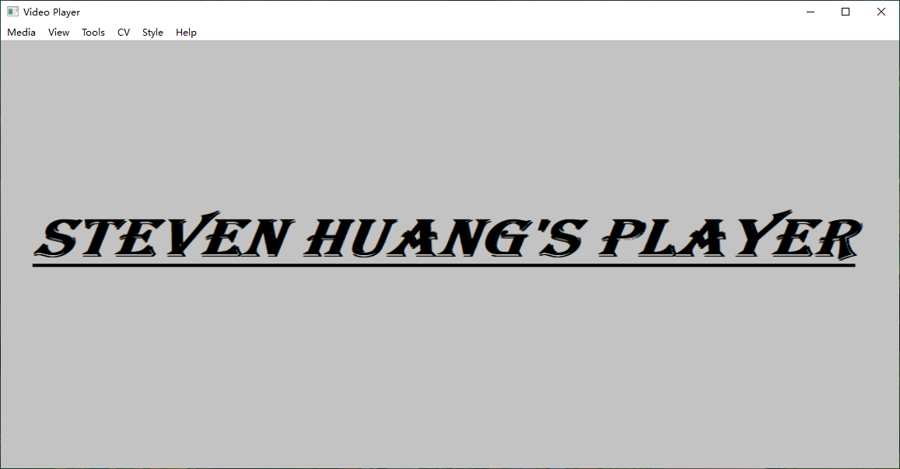
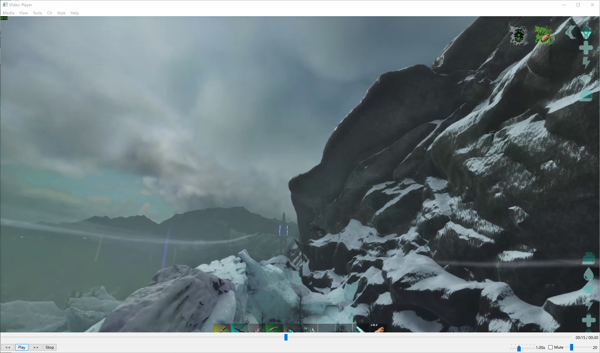

# VideoPlayer — 基于 Qt6 + FFmpeg 的多线程音视频播放器

## 一、项目介绍

VideoPlayer 是一款基于 C++、Qt6 和 FFmpeg 开发的桌面音视频播放器，支持本地文件及网络媒体播放。项目采用多线程架构，将媒体解封装、音视频解码和播放输出进行模块化设计，通过 PacketQueue 和 FrameQueue 实现线程间的数据缓冲与协作，并基于音频主时钟完成音画同步。同时支持播放控制、进度跳转、倍速播放、字幕显示和 DXVA2 硬件解码，并集成 OpenCV 图像处理功能，具有良好的扩展能力。

## 二、项目界面

### 1. 主界面



### 2. 视频播放界面



## 三、多线程协作机制

项目采用 **读取线程 → 解码线程 → 播放线程** 的多线程流水线架构，并通过 PacketQueue 和 FrameQueue 实现数据缓存与线程解耦。

```text
                 本地文件 / 网络媒体
                         │
                         ▼
                  ReadThread
                    媒体解封装
                         │
                    AVPacket
                         │
              ┌──────────┴──────────┐
              ▼                     ▼
       VideoPacketQueue      AudioPacketQueue
              │                     │
              ▼                     ▼
       VideoDecodeThread     AudioDecodeThread
              │                     │
            AVFrame               AVFrame
              │                     │
              ▼                     ▼
        VideoFrameQueue       AudioFrameQueue
              │                     │
              ▼                     ▼
        VideoPlayThread       AudioPlayThread
              │                     │
       帧同步 / 像素格式转换    重采样 / PCM 输出
              │                     │
              ▼                     ▼
          Qt 视频渲染           QAudioSink
```

- **读取线程（ReadThread）：** 基于 FFmpeg 完成解封装，将音视频 AVPacket 按 Stream Index 分发至对应 PacketQueue。
- **解码线程（DecodeThread）：** 独立完成音视频解码，将 AVPacket 转换为 AVFrame，并通过 FrameQueue 缓存解码结果。
- **播放线程（PlayThread）：** 视频线程负责同步调度及画面渲染，音频线程负责重采样与 PCM 输出。

线程间采用 `QMutex + QWaitCondition` 实现互斥访问、阻塞等待和线程唤醒，降低不同处理阶段的速度差异对播放流畅性的影响。

## 四、音画同步策略

项目采用 **Audio Master（音频主时钟）** 同步策略，以实际音频播放进度作为时间基准，通过动态调整视频帧显示时机实现音画同步。

### 1. 多时钟模型

播放器维护三种时钟：

- **Audio Clock：** 音频播放时钟，作为默认主时钟。
- **Video Clock：** 视频帧播放时间，用于与主时钟比较。
- **External Clock：** 外部参考时钟，用于其他同步模式。

### 2. 同步流程

```text
          Audio Clock（主时钟）
                    │
                    ▼
          获取 Video Clock
                    │
                    ▼
       diff = Video Clock - Audio Clock
                    │
           ┌────────┴────────┐
           ▼                 ▼
       diff > 0           diff < 0
       视频超前           视频落后
           │                 │
           ▼                 ▼
       延长等待时间       缩短等待时间
                             │
                             ▼
                      必要时丢弃过期帧
```

### 3. 动态同步调整

通过 `compute_target_delay()` 计算视频帧的目标显示延迟，并结合 `AV_SYNC_THRESHOLD_MIN`、`AV_SYNC_THRESHOLD_MAX` 等阈值进行同步修正：

- **视频超前：** 增大视频帧显示延迟，等待音频追赶。
- **视频落后：** 减小显示延迟，必要时丢弃过期帧。
- **时间轴切换：** Seek 后通过队列刷新、Serial 序列标识与时钟更新，避免旧数据影响新的播放时间轴。

通过上述机制动态修正音视频时间偏差（A/V Drift），提高播放器在不同帧率及播放场景下的同步稳定性。
